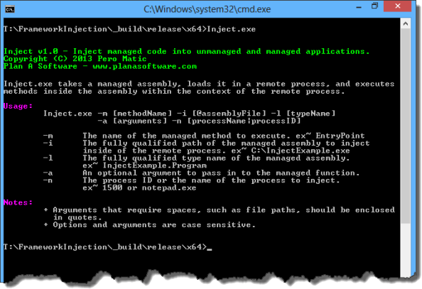
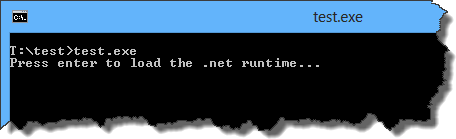
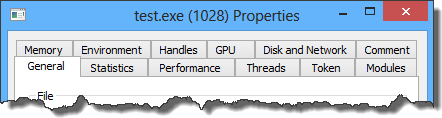
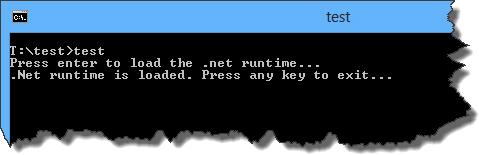
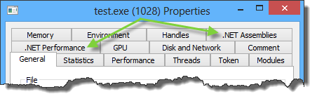
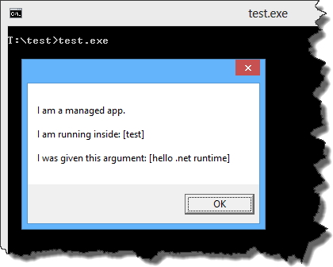
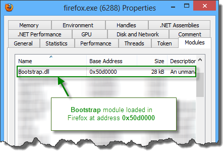
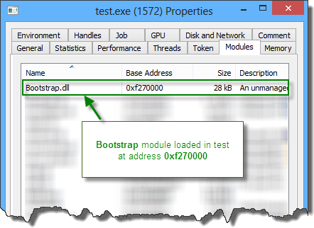
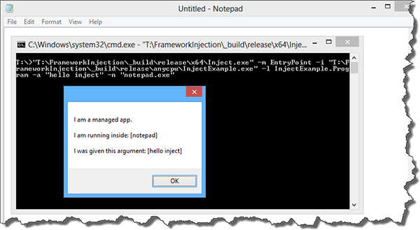
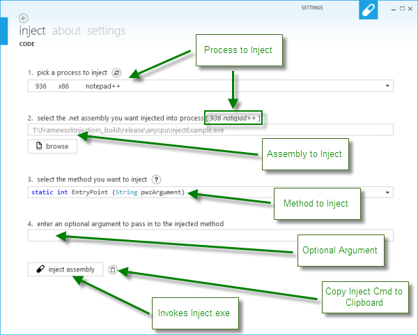

# Preamble

Presenting my authored article and code from 2013, initially published on [CodeProject](https://www.codeproject.com/Articles/607352/Injecting-NET-Assemblies-Into-Unmanaged-Processes) and now being migrated to GitHub with the code in its original form.



# Contents

*   [Introduction](#introduction)
*   [Back to Fundamentals](#back-to-fundamentals)
*   [Load the CLR](#load-the-clr)
    *   [Fundamentals](#load-the-clr-fundamentals)
    *   [Advanced](#load-the-clr-advanced)
*   [DLL Injection](#dll-injection)
    *   [Fundamentals](#dll-injection-fundamentals)
    *   [Advanced](#dll-injection-advanced)
*   [Putting It All Together](#putting-it-all-together)
*   [Running the Code](#running-the-code)
*   [Closing Notes](#closing-notes)

# Introduction

.NET is a powerful language for developing software quickly and reliably. However, there are certain tasks for which .NET is unfit. This paper highlights one particular case, DLL injection. A .NET DLL (aka managed DLL) cannot be injected inside a remote process in which the .NET runtime has not been loaded. Furthermore, even if the .NET runtime is loaded in a process one would like to inject, how can methods within the .NET DLL be invoked? What about architecture? Does a 64 bit process require different attention than a 32 bit process? The goal of this paper is to show how to perform all of these tasks using documented APIs. Together, we will:

*   Start the .NET CLR (common language runtime) in an arbitrary process regardless of bitness.
*   Load a custom .NET assembly in an arbitrary process.
*   Execute managed code in the context of an arbitrary process.

# Back to Fundamentals

Several things need to happen in order for us to achieve our goal. To make the problem more manageable, it will be broken down into several pieces and then reassembled at the end. The steps to solving this puzzle are:

1.  [Load The CLR (Fundamentals)](#load-the-clr-fundamentals) - Covers how to start the .NET Framework inside of an unmanaged process
2.  [Load The CLR (Advanced)](#load-the-clr-advanced) - Covers how to load a custom .NET assembly and invoke managed methods from unmanaged code
3.  [DLL Injection (Fundamentals)](#dll-injection-fundamentals) - Covers how to execute unmanaged code in a remote process
4.  [DLL Injection (Advanced)](#dll-injection-advanced) - Covers how to execute arbitrary exported functions in a remote process
5.  [Putting It All Together](#putting-it-all-together) - A solution presents itself; putting it all together

**Note**: The author uses the standard convention of function to refer to C++ functions, and method to refer to C# functions. The term "remote" process refers to any process other than the current process.

# Load the CLR

Writing an unmanaged application that can load both the .NET runtime and an arbitrary assembly into itself is the first step towards achieving our goal.

## Load the CLR Fundamentals

The following sample program illustrates how a C++ application can load the .NET runtime into itself:

```c++
#include <metahost.h>

#pragma comment(lib, "mscoree.lib")

#import "mscorlib.tlb" raw_interfaces_only \
    high_property_prefixes("_get","_put","_putref") \
    rename("ReportEvent", "InteropServices_ReportEvent")

int wmain(int argc, wchar_t* argv[])
{
    char c;
    wprintf(L"Press enter to load the .net runtime...");
    while (getchar() != '\n');    
    
    HRESULT hr;
    ICLRMetaHost *pMetaHost = NULL;
    ICLRRuntimeInfo *pRuntimeInfo = NULL;
    ICLRRuntimeHost *pClrRuntimeHost = NULL;
    
    // build runtime
    hr = CLRCreateInstance(CLSID_CLRMetaHost, IID_PPV_ARGS(&pMetaHost));
    hr = pMetaHost->GetRuntime(L"v4.0.30319", IID_PPV_ARGS(&pRuntimeInfo));
    hr = pRuntimeInfo->GetInterface(CLSID_CLRRuntimeHost, 
        IID_PPV_ARGS(&pClrRuntimeHost));
    
    // start runtime
    hr = pClrRuntimeHost->Start();
    
    wprintf(L".Net runtime is loaded. Press any key to exit...");
    while (getchar() != '\n');
    
    return 0;
}
```

In the above code, the calls of interest are:

|Function           |Description      |
|-------------------|-----------------|
|`CLRCreateInstance`| Given `CLSID_CLRMetaHost`, gets a pointer to an instance of `ICLRMetaHost`|
|`ICLRMetaHost::GetRuntime`|Get a pointer of type `ICLRRuntimeInfo` pointing to a specific .NET runtime|
|`ICLRRuntimeInfo::GetInterface`|Load the CLR into the current process and get a `ICLRRuntimeHost` pointer|
|`ICLRRuntimeHost::Start`|Explicitly start the CLR, implicitly called when managed code is first loaded|

At the time of this writing, the valid version values for `ICLRMetaHost::GetRuntime` are `NULL`, "`v1.0.3705`", "`v1.1.4322`", "`v2.0.50727`", and "`v4.0.30319`" where `NULL` loads the latest version of the runtime. The desired runtime should be installed on the system, and the version values above should be present in either _%WinDir%\\Microsoft.NET\\Framework or %WinDir%\\Microsoft.NET\\Framework64_.

Compiling and running the code above produces the following output as seen from the console and [Process Hacker](http://processhacker.sourceforge.net/):





Once pressing enter, it can be observed, via Process Hacker, that the .NET runtime has been loaded. Notice the additional tabs referencing .NET on the properties pane:





The above sample code is not included in the source download. However, it is recommended as an exercise for the reader to build and run the sample.

## Load the CLR Advanced

With the first piece of the puzzle in place, the next step is to load an arbitrary .NET assembly into a process and invoke methods inside that .NET assembly.

To continue building off the above example, the CLR has just been loaded into the process. This was achieved by obtaining a pointer to the CLR interface; this pointer is stored in the variable `pClrRuntimeHost`. Using `pClrRuntimeHost`, a call was made to `ICLRRuntimeHost::Start` to initialize the CLR into the process.

Now that the CLR has been initialized, `pClrRuntimeHost` can make a call to `ICLRRuntimeHost::ExecuteInDefaultAppDomain` to load and invoke methods in an arbitrary .NET assembly. The function has the following signature:

```c++
HRESULT ExecuteInDefaultAppDomain (
    [in] LPCWSTR pwzAssemblyPath,
    [in] LPCWSTR pwzTypeName, 
    [in] LPCWSTR pwzMethodName,
    [in] LPCWSTR pwzArgument,
    [out] DWORD *pReturnValue
);
```

A brief description of each parameter:

| Field             | Description                                                                      |
|-------------------|----------------------------------------------------------------------------------|
| `pwzAssemblyPath` | The full path to the .NET assembly; this can be either an EXE or a DLL file       |
| `pwzTypeName`     | The fully qualified typename of the method to invoke                             |
| `pwzMethodName`   | The name of the method to invoke                                                |
| `pwzArgument`     | An optional argument to pass into the method                                     |
| `pReturnValue`    | The return value of the method                                                   |

Not every method inside a .NET assembly can be invoked via `ICLRRuntimeHost::ExecuteInDefaultAppDomain`. Valid .NET methods must have the following signature:

```c#
static int pwzMethodName (String pwzArgument);
```

As a side note, access modifiers such as `public`, `protected`, `private`, and `internal` do not affect the visibility of the method; therefore, they have been excluded from the signature.

The following .NET application will be used in all the examples that follow as the managed .NET assembly to be injected inside processes:

```c#
using System;
using System.Windows.Forms;

namespace InjectExample
{
    public class Program
    {
        static int EntryPoint(String pwzArgument)
        {
            System.Media.SystemSounds.Beep.Play();

            MessageBox.Show(
                "I am a managed app.\n\n" + 
                "I am running inside: [" + 
                System.Diagnostics.Process.GetCurrentProcess().ProcessName + 
                "]\n\n" + (String.IsNullOrEmpty(pwzArgument) ? 
                "I was not given an argument" : 
                "I was given this argument: [" + pwzArgument + "]"));

            return 0;
        }

        static void Main(string[] args)
        {
            EntryPoint("hello world");
        }
    }
}
```

The example application above was written in such a way that it can be called via `ICLRRuntimeHost::ExecuteInDefaultAppDomain` or run standalone; with either approach producing similar behavior. The ultimate goal is that when injected into an unmanaged remote process, the application above will execute in the context of that process, and display a message box showing the remote process name.

Building on top of the sample code from the [Fundamentals](#load-the-clr-fundamentals) section, the following C++ program will load the above .NET assembly and execute the `EntryPoint` method:

```c++
#include <metahost.h>

#pragma comment(lib, "mscoree.lib")

#import "mscorlib.tlb" raw_interfaces_only \
    high_property_prefixes("_get","_put","_putref") \
    rename("ReportEvent", "InteropServices_ReportEvent")

int wmain(int argc, wchar_t* argv[])
{
    HRESULT hr;
    ICLRMetaHost *pMetaHost = NULL;
    ICLRRuntimeInfo *pRuntimeInfo = NULL;
    ICLRRuntimeHost *pClrRuntimeHost = NULL;
    
    // build runtime
    hr = CLRCreateInstance(CLSID_CLRMetaHost, IID_PPV_ARGS(&pMetaHost));
    hr = pMetaHost->GetRuntime(L"v4.0.30319", IID_PPV_ARGS(&pRuntimeInfo));
    hr = pRuntimeInfo->GetInterface(CLSID_CLRRuntimeHost, 
        IID_PPV_ARGS(&pClrRuntimeHost));
    
    // start runtime
    hr = pClrRuntimeHost->Start();
    
    // execute managed assembly
    DWORD pReturnValue;
    hr = pClrRuntimeHost->ExecuteInDefaultAppDomain(
        L"T:\\FrameworkInjection\\_build\\debug\\anycpu\\InjectExample.exe", 
        L"InjectExample.Program", 
        L"EntryPoint", 
        L"hello .net runtime", 
        &pReturnValue);
    
    // free resources
    pMetaHost->Release();
    pRuntimeInfo->Release();
    pClrRuntimeHost->Release();
    
    return 0;
}

```

The following screenshot shows the output of the application:



So far, two pieces of the puzzle are in place. It is now understood how to load the CLR and execute arbitrary methods from within unmanaged code. But how can this be done in arbitrary processes?

# DLL Injection

DLL injection is a strategy used to execute code inside a remote process by loading a DLL in the remote process. Many DLL injection tactics focus on code executing inside of `DllMain`. Unfortunately, attempting to start the CLR from within `DllMain` will cause the Windows loader to deadlock. This can be independently verified by writing a sample DLL that attempts to start the CLR from within `DllMain`. Verification is left as an excercise for the reader. For more information regarding .NET initialization, the Windows loader, and loader lock; please refer to the following MSDN articles:

*   [loaderLock MDA](http://msdn.microsoft.com/en-us/library/ms172219(v=VS.100).aspx)
*   [Initialization of Mixed Assemblies](http://msdn.microsoft.com/en-us/library/ms173266.aspx)
*   [Preventing Hangs in Windows Applications](http://msdn.microsoft.com/en-us/library/windows/desktop/dd744765(v=vs.85).aspx)

Inevitably, the result is that the CLR cannot be started while the Windows loader is initializing another module. Each lock is process specific and managed by Windows. Remember, any module that attempts to acquire more than one lock on the loader when a lock has already been acquired will deadlock.

## DLL Injection Fundamentals

The issue regarding the Windows loader seems sizable; and whenever a problem seems large, it helps to break it down into more manageable pieces. Developing a strategy to inject a barebones DLL inside of a remote process is a good start. Take the following sample code:

```c++
#define WIN32_LEAN_AND_MEAN
#include <windows.h>

BOOL APIENTRY DllMain(HMODULE hModule, DWORD ul_reason_for_call, LPVOID lpReserved)
{
    switch (ul_reason_for_call)
    {
    case DLL_PROCESS_ATTACH:
    case DLL_THREAD_ATTACH:
    case DLL_THREAD_DETACH:
    case DLL_PROCESS_DETACH:
        break;
    }
    return TRUE;
}
```

The above code implements a simple DLL. To inject this DLL in a remote process, the following Windows APIs are needed:

| Function              | Description                                        |
|-----------------------|----------------------------------------------------|
| `OpenProcess`         | Acquire a handle to a process                      |
| `GetModuleHandle`     | Acquire a handle to the given module               |
| `LoadLibrary`         | Load a library in the address space of the calling process |
| `GetProcAddress`      | Get the VA (virtual address) of an exported function from a library |
| `VirtualAllocEx`      | Allocate space in a given process                  |
| `WriteProcessMemory`  | Write bytes into a given process at a given address |
| `CreateRemoteThread`  | Spawn a thread in a remote process                 |

Moving on, the purpose of the function below is to execute an exported function of a DLL that has been loaded inside a remote process:

```c++
DWORD_PTR Inject(const HANDLE hProcess, const LPVOID function, 
    const wstring& argument)
{
    // allocate some memory in remote process
    LPVOID baseAddress = VirtualAllocEx(hProcess, NULL, GetStringAllocSize(argument), 
        MEM_COMMIT | MEM_RESERVE, PAGE_READWRITE);
    
    // write argument into remote process	
    BOOL isSucceeded = WriteProcessMemory(hProcess, baseAddress, argument.c_str(), 
        GetStringAllocSize(argument), NULL);
    
    // make the remote process invoke the function
    HANDLE hThread = CreateRemoteThread(hProcess, NULL, 0, 
        (LPTHREAD_START_ROUTINE)function, baseAddress, NULL, 0);
    
    // wait for thread to exit
    WaitForSingleObject(hThread, INFINITE);
    
    // free memory in remote process
    VirtualFreeEx(hProcess, baseAddress, 0, MEM_RELEASE);
    
    // get the thread exit code
    DWORD exitCode = 0;
    GetExitCodeThread(hThread, &exitCode);
    
    // close thread handle
    CloseHandle(hThread);
    
    // return the exit code
    return exitCode;
}
```

Remember that the goal in this section is to load a library in a remote process. The next question is how can the above function be used to inject a DLL in a remote process? The answer lies in the assumption that _kernel32.dll_ is mapped inside the address space of every process. `LoadLibrary` is an exported function of _kernel32.dll_ and it has a function signature that matches `LPTHREAD_START_ROUTINE`, so it can be passed as the start routine to `CreateRemoteThread`. Recall that the purpose of `LoadLibrary` is to load a library in the address space of the calling process, and the purpose of `CreateRemoteThread` is to spawn a thread in a remote process. The following snippet illustrates how to load our test DLL inside of a process with ID `3344`:

```c++
// get handle to remote process with PID 3344
HANDLE hProcess = OpenProcess(PROCESS_ALL_ACCESS, FALSE, 3344);

// get address of LoadLibrary
FARPROC fnLoadLibrary = GetProcAddress(GetModuleHandle(L"Kernel32"), "LoadLibraryW");

// inject test.dll into the remote process
Inject(hProcess, fnLoadLibrary, L"T:\\test\\test.dll");
```

To continue building off the above example, once `CreateRemoteThread` is invoked, a call is made to `WaitForSingleObject` to wait for the thread to exit. Next, a call is made to `GetExitCodeThread` to obtain the result. Coincidentally, when `LoadLibrary` is passed into `CreateRemoteThread`, a successful invocation will result in the `lpExitCode` of `GetExitCodeThread` returning the base address of the loaded library in the context of the remote process. This works great for 32-bit applications, but not for 64-bit applications. The reason is that `lpExitCode` of `GetExitCodeThread` is a `DWORD` value even on 64-bit machines, hence the address is truncated.

At this point, three pieces of the puzzle are in place. To recap, the following problems have been solved:

1.  Loading the CLR using unmanaged code
2.  Executing arbitrary .NET assemblies from unmanaged code
3.  Injecting DLLs

## DLL Injection Advanced

Now that loading a DLL in a remote process is understood; discussion on how to start the CLR in a remote process can continue.

When `LoadLibrary` returns, the lock on the loader will be free. With the DLL in the address space of the remote process, exported functions can be invoked via subsequent calls to `CreateRemoteThread`; granted that the function signature matches `LPTHREAD_START_ROUTINE`. However, this invariably leads to more questions. How can exported functions be invoked inside a remote process, and how can pointers to these functions be obtained? Since `GetProcAddress` does not have a matching `LPTHREAD_START_ROUTINE` signature, how can the addresses of functions inside the DLL be obtained? Furthermore, even if `GetProcAddress` could be invoked, it still expects a handle to the remote DLL. How can this handle be obtained for 64-bit machines?

It is time to divide and conquer again. The following function reliably returns the handle (coincidentally the base address) of a given module in a given process on both x86 and x64 systems:

```c++
DWORD_PTR GetRemoteModuleHandle(const int processId, const wchar_t* moduleName)
{
    MODULEENTRY32 me32; 
    HANDLE hSnapshot = INVALID_HANDLE_VALUE;
    
    // get snapshot of all modules in the remote process 
    me32.dwSize = sizeof(MODULEENTRY32); 
    hSnapshot = CreateToolhelp32Snapshot(TH32CS_SNAPMODULE, processId);
    
    // can we start looking?
    if (!Module32First(hSnapshot, &me32)) 
    {
        CloseHandle(hSnapshot);
        return 0;
    }
    
    // enumerate all modules till we find the one we are looking for 
    // or until every one of them is checked
    while (wcscmp(me32.szModule, moduleName) != 0 && Module32Next(hSnapshot, &me32));
    
    // close the handle
    CloseHandle(hSnapshot);
    
    // check if module handle was found and return it
    if (wcscmp(me32.szModule, moduleName) == 0)
        return (DWORD_PTR)me32.modBaseAddr;
    
    return 0;
}
```

Knowing the base address of the DLL in the remote process is a step in the right direction. It is time to devise a strategy for acquiring the address of an arbitrary exported function. To recap, it is known how to call `LoadLibrary` and obtain a handle to the loaded module in a remote process. Knowing this, it is trivial to invoke `LoadLibrary` locally (within the calling process) and obtain a handle to the loaded module. This handle (which is also the base address of the module) may or may not be the same as the one in the remote process, even though it is the same library. Nevertheless, with some basic math, we can acquire the address for any exported function we wish. The idea is that although the base address of a module may differ from process to process, the offset of any given function relative to the base address of the module is constant. As an example, take the following exported function found in the Bootstrap DLL project in the source download:

```c++
__declspec(dllexport) HRESULT ImplantDotNetAssembly(_In_ LPCTSTR lpCommand)
```

Before this function can be invoked remotely, the _Bootstrap.dll_ module must first be loaded in the remote process. Using Process Hacker, here is a screenshot of where the Windows loader placed the _Bootstrap.dll_ module in memory when injected into Firefox:



Continuing with our strategy, here is a sample program that loads the _Bootstrap.dll_ module locally (within the calling process):

```c++
#include <windows.h>

int wmain(int argc, wchar_t* argv[])
{
    HMODULE hLoaded = LoadLibrary(
        L"T:\\FrameworkInjection\\_build\\release\\x86\\Bootstrap.dll");
    system("pause");
    return 0;
}
```

When the above program is run, here is a screenshot of where Windows decided to load the _Bootstrap.dll_ module:



The next step is, within `wmain`, to make a call to `GetProcAddress` to get the address of the `ImplantDotNetAssembly` function:

```c++
#include <windows.h>

int wmain(int argc, wchar_t* argv[])
{
    HMODULE hLoaded = LoadLibrary(
        L"T:\\FrameworkInjection\\_build\\debug\\x86\\Bootstrap.dll");
    
    // get the address of ImplantDotNetAssembly
    void* lpInject = GetProcAddress(hLoaded, "ImplantDotNetAssembly");
    
    system("pause");
    return 0;
}
```

The address of a function within a module will always be higher than the module's base address. Here is where basic math comes in to play. Below is a table to help illustrate:

|              |                  |                       |
|--------------|------------------|-----------------------|
| _Firefox.exe_ | `Bootstrap.dll @ 0x50d0000` | `ImplantDotNetAssembly @ ?` |
| _test.exe_    | `Bootstrap.dll @ 0xf270000` | `ImplantDotNetAssembly @ 0xf27149 (lpInject)` |

_Test.exe_ shows that _Bootstrap.dll_ is loaded at address `0xf270000`, and that `ImplantDotNetAssembly` can be found in memory at address `0xf271490`. Subtracting the address of `ImplantDotNetAssembly` from the address of _Bootstrap.dll_ will give the offset of the function relative to the base address of the module. The math shows that `ImplantDotNetAssembly` is (`0xf271490 - 0xf270000`) = `0x1490` bytes into the module. This offset can then be added onto the base address of the _Bootstrap.dll_ module in the remote process to reliably give the address of `ImplantDotNetAssembly` relative to the remote process. The math to compute the address of `ImplantDotNetAssembly` in _Firefox.exe_ shows that the function is located at address (`0x50d0000 + 0x1490`) = `0x50d1490`. The following function computes the offset of a given function in a given module:

```c++
DWORD_PTR GetFunctionOffset(const wstring& library, const char* functionName)
{
    // load library into this process
    HMODULE hLoaded = LoadLibrary(library.c_str());
    
    // get address of function to invoke
    void* lpInject = GetProcAddress(hLoaded, functionName);
    
    // compute the distance between the base address and the function to invoke
    DWORD_PTR offset = (DWORD_PTR)lpInject - (DWORD_PTR)hLoaded;
    
    // unload library from this process
    FreeLibrary(hLoaded);
    
    // return the offset to the function
    return offset;
}
```

It is worth noting that `ImplantDotNetAssembly` intentionally matches the signature of `LPTHREAD_START_ROUTINE`; as should all methods passed to `CreateRemoteThread`. Armed with the ability to execute arbitrary functions in a remote DLL, the logic to initialize the CLR has been put inside function `ImplantDotNetAssembly` in _Bootstrap.dll_. Once _Bootstrap.dll_ is loaded in a remote process, the address of `ImplantDotNetAssembly` can be computed for the remote instance and then invoked via `CreateRemoteThread`. This is it, the final piece of the puzzle; now it is time to put it all together.

# Putting It All Together

The main reason behind using an unmanaged DLL (_Bootstrap.dll_) to load the CLR is that if the CLR is not running in the remote process, the only way to start it is from unmanaged code (barring use of a scripting language such as Python, which has its own set of dependencies).

In addition, it would be nice for the `Inject` application to be flexible enough to accept input on the command line; because who would want to recompile every time their app changes? The `Inject` application accepts the following options:

| Option | Description |
|--------|-------------|
| `-m`   | The name of the managed method to execute. _e.g., EntryPoint_ |
| `-i`   | The fully qualified path of the managed assembly to inject inside the remote process. _e.g., C:\\InjectExample.exe_ |
| `-l`   | The fully qualified type name of the managed assembly. _e.g., InjectExample.Program_ |
| `-a`   | An optional argument to pass into the managed function. |
| `-n`   | The process ID or the name of the process to inject. _e.g., 1500 or notepad.exe_ |

The `wmain` method for `Inject` looks like:

```c++
int wmain(int argc, wchar_t* argv[])
{	
    // parse args (-m -i -l -a -n)
    if (!ParseArgs(argc, argv))
    {
        PrintUsage();
        return -1;
    }
    
    // enable debug privileges
    EnablePrivilege(SE_DEBUG_NAME, TRUE);
    
    // get handle to remote process
    HANDLE hProcess = OpenProcess(PROCESS_ALL_ACCESS, FALSE, g_processId);
    
    // inject bootstrap.dll into the remote process
    FARPROC fnLoadLibrary = GetProcAddress(GetModuleHandle(L"Kernel32"), 
        "LoadLibraryW");
    Inject(hProcess, fnLoadLibrary, GetBootstrapPath()); 
    
    // add the function offset to the base of the module in the remote process
    DWORD_PTR hBootstrap = GetRemoteModuleHandle(g_processId, BOOTSTRAP_DLL);
    DWORD_PTR offset = GetFunctionOffset(GetBootstrapPath(), "ImplantDotNetAssembly");
    DWORD_PTR fnImplant = hBootstrap + offset;
    
    // build argument; use DELIM as tokenizer
    wstring argument = g_moduleName + DELIM + g_typeName + DELIM + 
        g_methodName + DELIM + g_Argument;
    
    // inject the managed assembly into the remote process
    Inject(hProcess, (LPVOID)fnImplant, argument);
    
    // unload bootstrap.dll out of the remote process
    FARPROC fnFreeLibrary = GetProcAddress(GetModuleHandle(L"Kernel32"), 
        "FreeLibrary");
    CreateRemoteThread(hProcess, NULL, 0, (LPTHREAD_START_ROUTINE)fnFreeLibrary, 
        (LPVOID)hBootstrap, NULL, 0);
    
    // close process handle
    CloseHandle(hProcess);
    
    return 0;
}
```

Below is a screenshot of the _Inject.exe_ app being called to inject the .NET assembly _InjectExample.exe_ into _notepad.exe_ along with the command line that was used:

"T:\\FrameworkInjection\\\_build\\release\\x64\\Inject.exe" -m EntryPoint -i "T:\\FrameworkInjection\\\_build\\release\\anycpu\\InjectExample.exe" -l InjectExample.Program -a "hello inject" -n "notepad.exe"



It is worthwhile to mention and distinguish the differences between injecting a DLL that was built targetting x86, x64, or AnyCPU. Under normal circumstances, the x86 flavor of _Inject.exe_ and _Bootstrap.dll_ should be used to inject x86 processes, and the x64 flavor should be used to inject x64 processes. It is the responsibility of the caller to ensure the proper binaries are used. AnyCPU is a platform available in .NET. Targetting AnyCPU tells the CLR to JIT the assembly for the appropriate architecture. This is why the same _InjectExample.exe_ assembly can be injected into either an x86 or x64 process.

# Running the Code

Moving on to the fun stuff! There are a few prerequisites for getting the code to run using the default settings.

To build the code:

1.  [Visual Studio 2012 Express](http://www.microsoft.com/en-us/download/details.aspx?id=34673) +
2.  [Visual Studio 2012 Express Update 1](http://www.microsoft.com/en-us/download/details.aspx?id=38188) +

To run the code:

1.  [.Net Framework 4.0](http://www.microsoft.com/en-us/download/details.aspx?id=17718) +
2.  [Visual C++ Redistributable for Visual Studio 2012 Update 1](http://www.microsoft.com/en-us/download/details.aspx?id=30679) +
3.  Windows XP SP3 +

To simplify the task of building the code, there is a file called _build.bat_ in the source download that will take care of the heavy lifting provided the prerequisites have been installed. It will compile both the debug and release builds along with the corresponding x86, x64, and AnyCPU builds. Each project can also be built independently, and will compile from Visual Studio. The script _build.bat_ will place the binaries in a folder named _\_build_.

The code is also well commented. In addition, C++ 11.0 and .NET 4.0 were chosen because both runtimes will execute on all Windows OSes from XP SP3 x86 to Windows 8 x64. As a side note, Microsoft added XP SP3 support for the C++ 11.0 runtime in [VS 2012 U1](http://www.microsoft.com/en-us/download/details.aspx?id=38188).

# Closing Notes

Traditionally, at this point papers tend to wind down and reflect on the techniques learned and other areas of improvement. While this is an excellent place to perform such an exercise, the author decided to do something different and present the reader with a basket full of:


As mentioned in the [Introduction](#introduction), .NET is a powerful language. For example, the Reflection API in .NET can be leveraged to obtain type information about assemblies. The significance of this is that .NET can be used to scan an assembly and return the valid methods that can be used for injection! The source download contains a .NET project called `InjectGUI`. This project contains a managed wrapper around our unmanaged Inject application. `InjectGUI` displays a list of running processes, decides whether to invoke the 32 or 64 bit version of `Inject`, as well as scans .NET assemblies for valid injectable methods. Within `InjectGUI` is a file named _InjectWrapper.cs_ which contains the wrapper logic.

There is also a helper class called `MethodItem` which has the following definition:

```c#
public class MethodItem
{
    public string TypeName { get; set; }
    public string Name { get; set; }
    public string ParameterName { get; set; }
}
```

The following snippet from the `ExtractInjectableMethods` method will obtain a `Collection` of type `List<MethodItem>`, which matches the required method signature:

```c#
// find all methods that match: 
//    static int pwzMethodName (String pwzArgument)

private void ExtractInjectableMethods()
{
    // ...

    // open assembly
    Assembly asm = Assembly.LoadFile(ManagedFilename);

    // get valid methods
    InjectableMethods = 
        (from c in asm.GetTypes()
        from m in c.GetMethods(BindingFlags.Static | 
            BindingFlags.Public | BindingFlags.NonPublic)
        where m.ReturnType == typeof(int) &&
            m.GetParameters().Length == 1 &&
            m.GetParameters().First().ParameterType == typeof(string)
        select new MethodItem
        {
            Name = m.Name,
            ParameterName = m.GetParameters().First().Name,
            TypeName = m.ReflectedType.FullName
        }).ToList();

    // ...
}
```

Now that the valid (injectable) methods have been extracted, the UI should also know if the process to be injected is 32 or 64 bit. To do this, a little help is needed from the Windows API:

```c#
[DllImport("kernel32.dll", SetLastError = true, CallingConvention = CallingConvention.Winapi)]
[return: MarshalAs(UnmanagedType.Bool)]
private static extern bool IsWow64Process([In] IntPtr process, [Out] out bool wow64Process);
```

`IsWow64Process` is only defined on 64 bit OSes, and it returns `true` if the app is 32 bit. In .NET 4.0, the following property has been introduced: `Environment.Is64BitOperatingSystem`. This can be used to help determine if the `IsWow64Process` function is defined as seen in this wrapper function:

```c#
private static bool IsWow64Process(int id)
{
    if (!Environment.Is64BitOperatingSystem)
        return true;

    IntPtr processHandle;
    bool retVal;

    try
    {
        processHandle = Process.GetProcessById(id).Handle;
    }
    catch
    {
        return false; // access is denied to the process
    }

    return IsWow64Process(processHandle, out retVal) && retVal;
}
```

The logic inside the `InjectGUI` project is fairly straightforward. Some understanding of WPF and Dependency Properties is necessary to understand the UI, however, all the pertinent logic related to injection is in the `InjectWrapper` class. The UI is built using [Modern UI for WPF](http://mui.codeplex.com/), and the icons are borrowed from [Modern UI Icons](http://modernuiicons.com/). Both projects are open source, and the author is affiliated with neither. Below is a screenshot of `InjectGUI` in action:



# Closing Notes Part Deux

This concludes the discussion on injecting .NET assemblies into unmanaged processes. Don't cry because it's over. Smile ☺ because it happened. _~ William Shakespeare_

# History

*   22/06/2013: Initial release